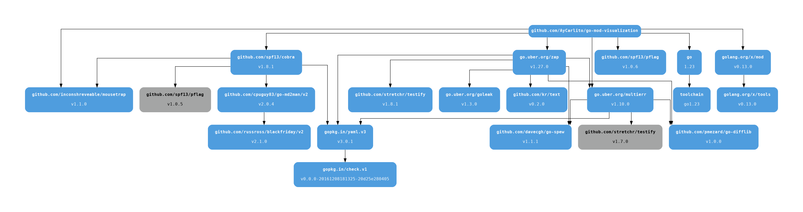
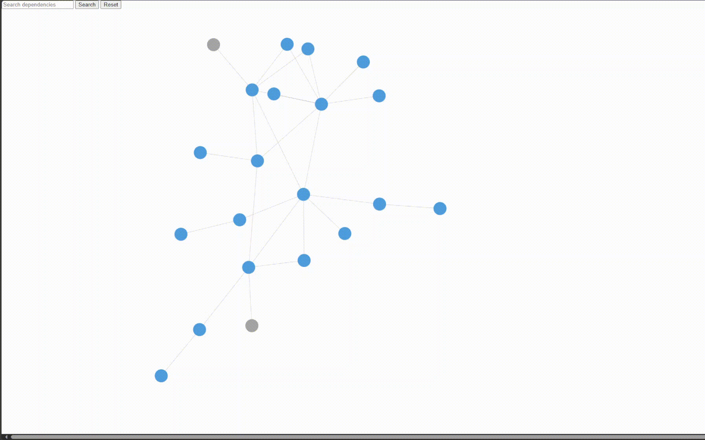

# go-mod-visualization

go-mod-visualization visualizes Go module dependencies.

## Prerequisites

Install the following:

1. [Go](https://go.dev/dl/)
2. [Docker](https://docs.docker.com/engine/install/)

## Install

- Build the binary:

```shell
git clone https://github.com/AyCarlito/go-mod-visualization.git
cd go-mod-visualization
make build
```

- Move the binary to the desired location e.g:

```shell
mv bin/go-mod-visualization /usr/local/bin/
```

- Alternatively, the application is containerised through the `Dockerfile` at the root of the repository, which can
be built and run through:

```shell
make docker-build docker-run
```

## Usage

- `go-mod-visualization` is a [Cobra](https://github.com/spf13/cobra) CLI application built on a structure of commands,
arguments & flags:

```shell
./bin/go-mod-visualization --help
Visualize go module dependencies.

Usage:
  go-mod-visualization [flags]

Flags:
      --format string   Output format. Must be one of 'dot' or 'html'. (default "dot")
  -h, --help            help for go-mod-visualization
      --input string    Path to input file. Reads from stdin if unset.
      --output string   Path to output file. Writes to stdout if unset.
```

## Examples

- Write a graphviz directed graph to stdout.
- This can be piped to the `dot` command to produce an image.

```shell
go mod graph | ./bin/go-mod-visualization  | dot -Tpng:cairo > docs/go-mod-visualization.png
{"level":"info","time":"2025-06-25T22:04:58.301+0100","caller":"visualizer/visualizer.go:34","msg":"Starting visualization"}
{"level":"info","time":"2025-06-25T22:04:58.301+0100","caller":"visualizer/visualizer.go:46","msg":"Building graph"}
{"level":"info","time":"2025-06-25T22:04:58.363+0100","caller":"visualizer/visualizer.go:81","msg":"Converting graph"}
{"level":"info","time":"2025-06-25T22:04:58.363+0100","caller":"visualizer/visualizer.go:97","msg":"Writing output"}
```



- Write an interactive force-directed graph to file that can be viewed in-browser.
- This is built using the [force-graph](https://github.com/vasturiano/force-graph) library.
- This format is preferred as the size of the dependency graph increases.

```shell
go mod graph | ./bin/go-mod-visualization --output docs/go-mod-visualization.html --format html
```


